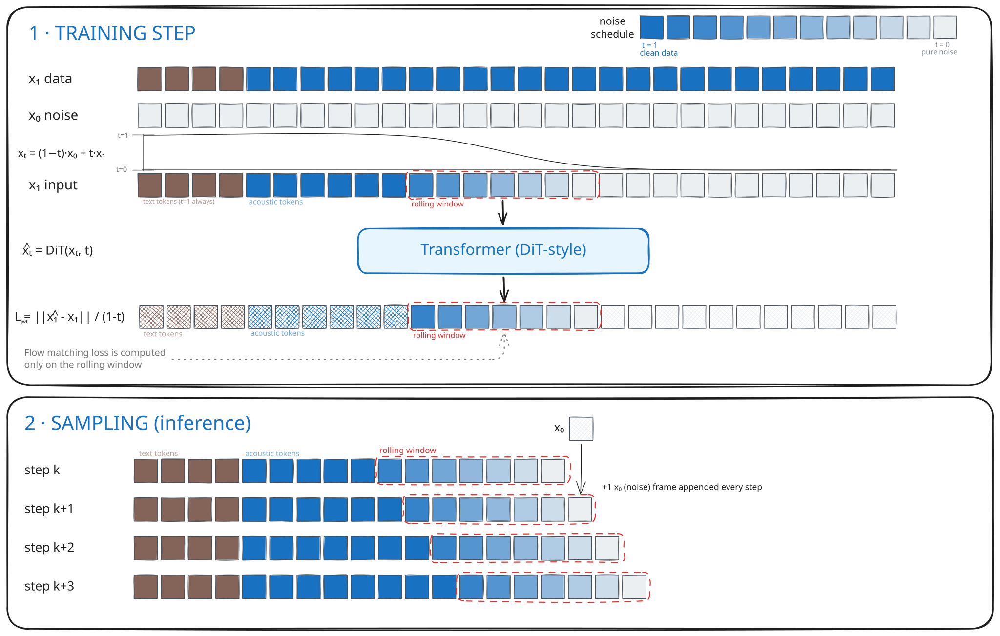
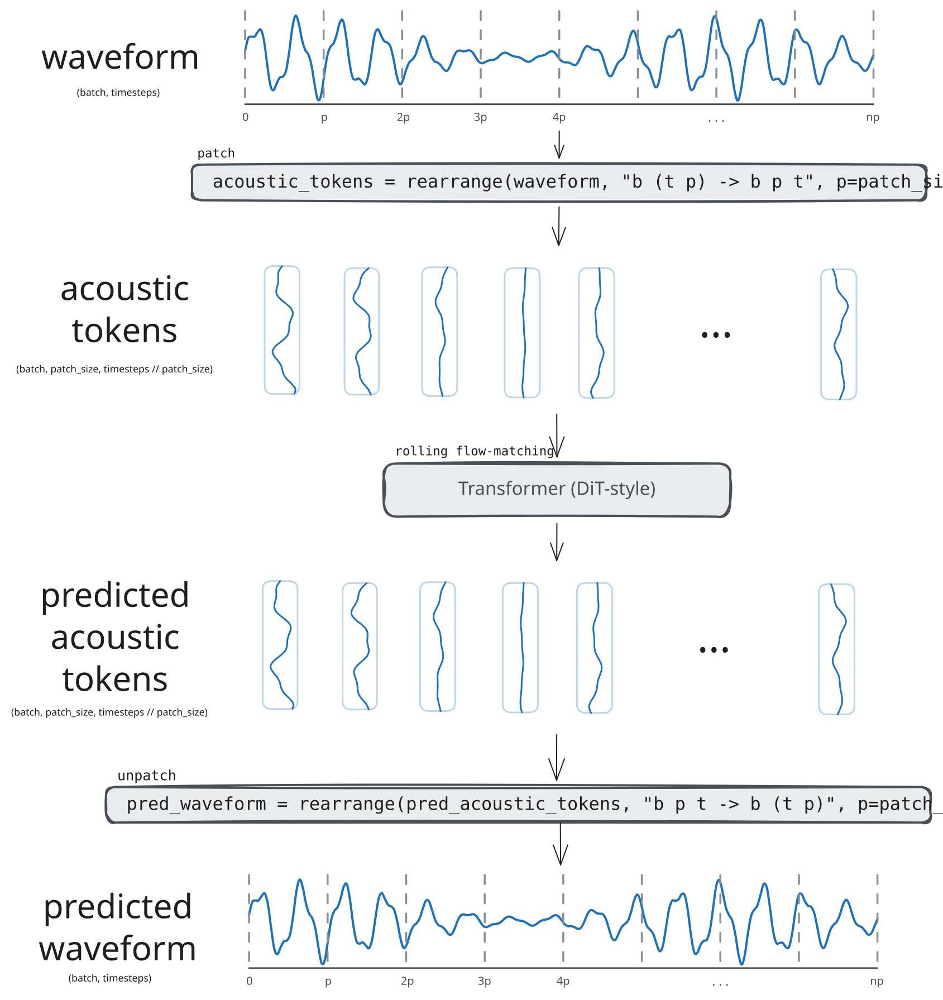
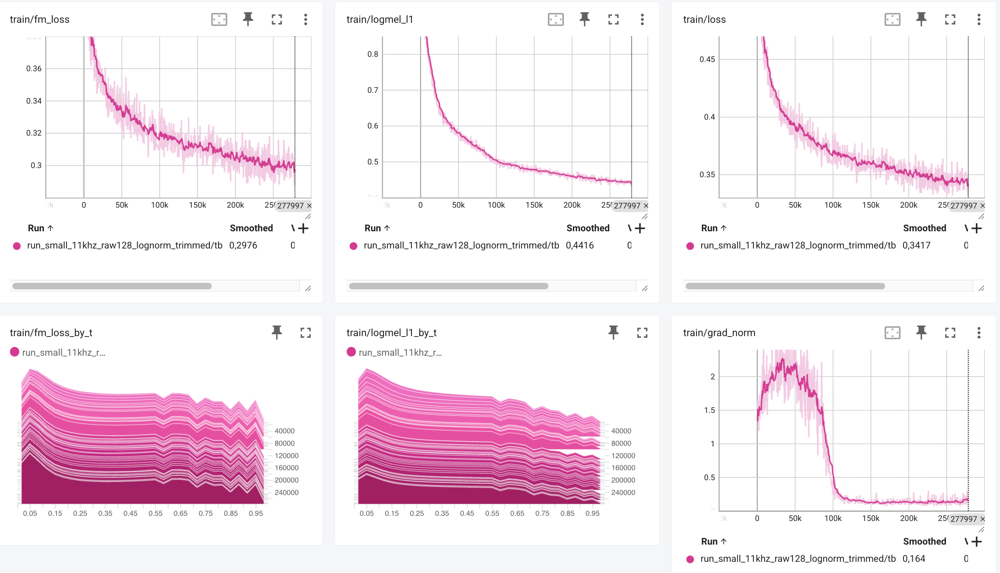

# tts

Streaming text-to-speech via **rolling flow matching** transformer that predicts **raw waveforms** directly, no codec, no audio tokenizer, no adversarial training.

- 🌊 **Streaming, frame by frame** — one clean audio frame per forward pass; constant per-frame latency, no "wait for the whole ODE loop" delay.
- 🎯 **Waveform → transformer → waveform** — a single transformer predicts raw audio directly. No codec, no tokenizer, no vocoder.
- 🔮 **Future-aware** — unlike autoregressive token models, attention spans noisy upcoming positions, so the model can plan continuity across boundaries instead of committing one token at a time.
- 🪢 **End-to-end** — text in, raw audio out, gradients flow the whole way. One model, no detached losses.

<p align="center">
  <a href="https://lgestin.github.io/tts/">
    
  </a>
</p>

---

## Rolling Flow Matching

The rolling flow matching approach is autoregressive flow matching. A denoising front walks across the sequence frame by frame: the multi-step flow matching cost is amortized across positions in a rolling window, so the steady state is **one clean frame out per forward pass**.

Standard flow matching denoises the entire sequence at once — great for fixed-length signals like images, but no output emerges until the whole ODE loop finishes, which rules out streaming. Autoregressive token models have the opposite tradeoff: one token per forward pass, perfect for streaming, but blind to future positions and usually tied to a discrete codec.

**Rolling-window denoising does both.** A window of `n` frames straddles the front, with `t` evenly spaced across it. Each forward pass advances the front by one: the leftmost frame finishes denoising and is emitted; a new noise frame appears on the right.

This gives:

- 〰️ **Continuous all the way** — flow matching emits continuous vectors instead of discrete tokens, matching audio's nature. With JWT (next section), those vectors _are_ raw waveform patches — no codec in between.
- 🔮 **Future context** — the attention window includes noisy upcoming positions, so the model can plan continuity across the boundary instead of committing one token at a time.
- ⏳ **No duration prediction** — the sequence grows one frame at a time and the model decides when to stop; no separate length predictor decoupled from generation.
- 🌊 **Streaming** — one frame out per forward pass, after the warmup of denoising the first window.

<p align="center">
  <br>
  <em>The denoising front walks left-to-right; one clean frame is emitted per forward pass.</em>
</p>

### Training

At training time, for every sequence in the batch we sample a random front position and noise each
At each training step a denoising front is sampled at a random position in the sequence, the next `n` tokens are included in the denoising window and noised with increasing levels of noise to simulate:

- Positions left of the front (past) are **clean** (`t = 1`).
- Positions inside the `n`-frame rolling window carry **intermediate** `t`, spaced according to a flow matching timestep-schedule.
- Positions right of the window (future) are **pure noise** (`t = 0`).

An attention mask cuts off visibility past the noise positions — beyond the window, the model can't peek.

**One forward pass, `n` supervisions.** Loss is applied at _every_ position in the window, not just the leftmost. A single forward pass therefore supervises the full `n`-step denoising trajectory at once — each window position is the model's prediction at a different point along that trajectory. The per-step training cost is the same as standard flow matching.

**Timesteps schedule.** The mapping from uniform progress across the window to actual `t` values is selectable: `linear` (uniform spacing) or `log_norm` (logit-normal warp — JiT's choice, skewed toward small `t`), or `log_norm_trimmed` (same warp with the right tail clipped to avoid an oversized final Euler step near `t = 1`).

**Window size.** Training uses a large rolling window so attention has enough context — past and noisy-future — to learn the denoising dynamics well. Inference can re-use the same window or shrink it via a short finetune for tighter latency.

### Inference

**Parallel patch denoising.** At inference, we run the DiT on our growing sequence of noisy patches. Each forward pass advances every window position by one denoising step — so by the time the front-most patch is clean, the next is already one step from done, and the one after that two, and so on. The multi-step cost is amortized across positions, not paid per frame, allowing efficient streaming.

**Stopping.** During training, we append to the waveform a specific OOD set of values (pure zeros), which we detect via a heuristic during inference. We also monitor attention map to make sure all phonemes were pronounced when we decide to stop

**KV caching.** This approach allows us to cache the KV results for all previously denoised frames, so each step only computes attention for the rolling-window positions.

---

## Just Waveform Transformers (JWT)

JWT is a formulation of the flow matching objective that allows us to predict audio in the waveform domain directly. The audio is embedded with linear input/output projections, no codec, no tokenizer, no separate vocoder, no adversarial components. The 24,000 floats per second the rest of the field preprocesses around become the input layer.

This gives:

- ⚙️ Dead simple system — waveform -> transformer -> waveform. No codec, no tokenizer, no vocoder, no adversarial loss.
- 🪢 End-to-end training — gradients reach the raw waveform; no detached losses, no frozen vocoder, no reconstruction-quality ceiling from a separate codec.
- 〰️ Raw-waveform output unlocks any signal-space loss — mel-spectrogram L1, perceptual losses à la [PixelGen](https://arxiv.org/abs/2602.02493), even adversarial supervision — as drop-in additions. We currently use only the mel L1; the architecture is what makes the rest available.

The dominant TTS recipe sidesteps the dimensionality of raw audio by compressing first: a neural audio codec ([Encodec](https://arxiv.org/abs/2210.13438), [DAC](https://arxiv.org/abs/2306.06546), [SoundStream](https://arxiv.org/abs/2107.03312), [Mimi](https://kyutai.org/codec-explainer)) maps the waveform to a low-rate stream of discrete tokens; an autoregressive transformer predicts those tokens from text ([Moshi](https://arxiv.org/abs/2410.00037), [VALL-E](https://arxiv.org/abs/2301.02111) and descendants); a decoder reconstructs the waveform. The more recent continuous variants — Mistral's [Voxtral-TTS](https://mistral.ai/news/voxtral-tts), Kyutai's [Pocket TTS](https://kyutai.org/pocket-tts-technical-report) — keep the learned codec but swap discrete tokens for continuous latents with a flow-matching head. **Every variant operates in a learned latent space** — and pays for it: a codec to train and version, failure modes of its own (RVQ collapse, bitrate-vs-fidelity tradeoffs), an inference pipeline touching three networks instead of one.

**JWT tests that assumption.** The idea is borrowed from Li & He's [_Back to Basics: Let Denoising Generative Models Denoise_](https://arxiv.org/abs/2511.13720) — the "Just image Transformers" (JiT) paper — which shows a plain ViT on large raw-pixel patches does pixel-space diffusion competitively with no VAE, tokenizer, or perceptual loss.

**The manifold argument.** Real audio patches lie on a low-dimensional manifold inside the high-dimensional ambient space (ℝ¹²⁸ for a 128-sample patch). Noise `ε` and flow velocity `v = x − ε` don't — by construction they're Gaussian-distributed across the full ambient space. Predicting them requires network capacity proportional to that ambient dimension; predicting the clean target `x` directly only requires enough capacity to represent the manifold. At large patch dimension, the gap matters: ε- and v-prediction collapse for finite-capacity networks, while `x`-prediction trains stably. JiT shows this on pixels; JWT inherits the same argument for raw audio.

### Raw Audio Patching

The `RawAudioPatcher` "codec" is a deterministic reshape: `rearrange("b (t p) -> b p t")`. No learned compression, no STFT, no VAE. A patch of `P` consecutive raw samples becomes one acoustic frame of dimension `P`; the transformer's input/output linear projections learn the per-patch embedding end-to-end. Decoding is the exact inverse (`rearrange("b p t -> b (t p)")`).

<p align="center">
    <br>
    <em>P consecutive raw samples become one patch of dimension P.</em>
</p>

### Training objective

Following JiT's parametrization, the DiT predicts the clean patch `x_1` directly from the noisy patch `x_t` and timestep `t`:

$$\hat{x}_1 = \mathrm{DiT}(x_t, t)$$

$$\mathcal{L} = \frac{\lVert \hat{x}_1 - x_1 \rVert}{1 - t} + \lambda_{\text{mel}} \cdot \lVert \log\mathrm{mel}(\hat{x}_1) - \log\mathrm{mel}(x_1) \rVert_1$$

<br clear="all">

---

## Results

Trained from [`configs/runpod.yaml`](configs/runpod.yaml) — a 12-layer DiT (dim 512, 8 heads, **57M parameters**) on LJSpeech at 11.025 kHz with 128-sample raw patches (≈11.6 ms per patch). `LOG_NORM_TRIMMED` timestep schedule, 128 denoising steps, log-mel L1 auxiliary at weight 0.1, AdamW (lr 3e-4, 10k-step warmup), batch size 128, BF16. **~278k steps on a single A100** (config caps at 1M).

<p align="center">
  <br>
  <em>Top: <code>fm_loss</code>, <code>logmel_l1</code>, and combined <code>loss</code> all converge smoothly. Bottom-left and bottom-middle: per-bin loss by <code>t</code> — analyzed below. Bottom-right: gradient norm settles after warmup (~step 100k) to ≈0.16.</em>
</p>

**Reading the per-`t` loss profiles.** Both `fm_loss` and `logmel_l1` are highest at low `t` and decrease toward high `t`. This is the expected denoising-difficulty curve, at `t` close to $0$ the patch is close to pure noise, predicting `x_1` from there is a tough task, thus a higher loss, the more t moves toward 1, the easier the task becomes, this is what the per-t profiles confirm.

The fm_loss curve descends without plateau or divergence — the manifold argument transfers from pixels to waveform patches in practice.

**This is a proof of concept by design.** The conditions were deliberately constrained — single-speaker LJSpeech, 11.025 kHz, 57M parameters, single A100 — to validate the core hypothesis (rolling flow matching on raw waveform patches trains stably and converges to intelligible speech) without scale confounds. Now that it works, the agenda is scaling in every direction: bigger model, more data, higher sample rate, longer training. See [Next steps](#next-steps).

Loss values establish that training is stable but say nothing about perceptual quality; for the real evaluation, hear the samples:

<p align="center">
  <a href="https://lgestin.github.io/tts/">
    
  </a>
</p>

## Next steps

**📈 Scale**

- [ ] **Bigger transformer.** The current 12L / dim-512 was sized for one-GPU iteration speed; nothing about the architecture suggests it won't keep paying off.
- [ ] **Higher sample rate** — 11.025 kHz → 22.050 kHz → 44.1 kHz.
- [ ] **Patch size × dimension × sample-rate sweep** — map the tradeoff space as model and data grow.
- [ ] **Multi-speaker training** — move from LJSpeech to a multi-speaker corpus and condition generation with a speaker utterance.

**🧠 Capabilities**

- [ ] **EOS Robustness** — RMS-threshold detector and attention map stopping can sometimes fail and cut generation short or let it run for a long time. Improving this is top priority.
- [ ] **Semantic text embedding** to replace the phoneme tokenizer and widen the conditioning signal.
- [ ] **Classifier Free Guidance (CFG)**
- [ ] **Explore perceptual / adversarial losses** — the JWT architecture supports any signal-space loss as drop-in (mel L1 is the only one we currently use); explore perceptual losses à la PixelGen and lightweight adversarial supervision.

**⚡ Inference performance**

- [ ] **Shrink the rolling window via short finetune** — lower per-frame latency without retraining from scratch.
- [ ] **KV caching** for the generated frames and text.

---

## Reproduce

<details>
<summary>Install + train</summary>

```bash
uv sync --all-extras
# data: LJSpeech preprocessed to a pyarrow file (see scripts/data/)
uv run python scripts/train.py --config_path configs/small.yaml
# resume from a saved run
uv run python scripts/train.py --config_path outputs/<run>/config.yaml
```

Hardware: <!-- FILL IN: e.g. "single RTX 4090, ~Xh to convergence" --> <br>
Configs: `small.yaml` (11 kHz raw128), `small_8khz.yaml`, `small_11khz.yaml`, `runpod.yaml`

</details>

## License

MIT
